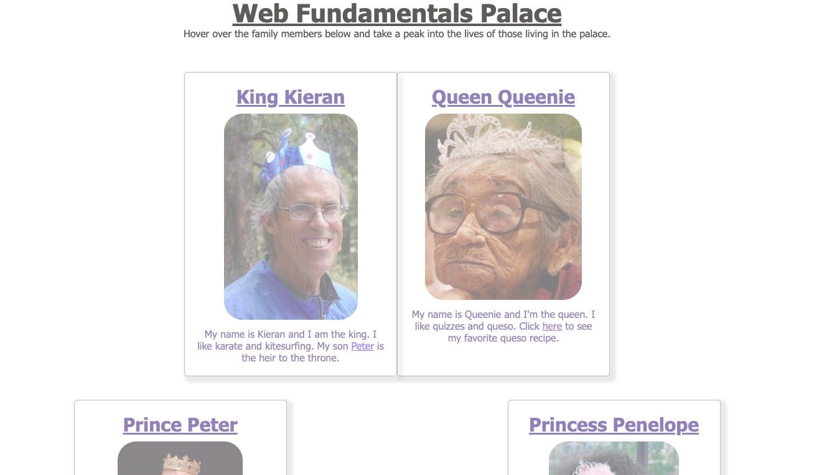

# Web Fundamentals

## Description

This project was part of the prework and was intended to teach us all the basics of HTML and CSS. It displays a royal family, with each member placed in a card and positioned as a family tree.

